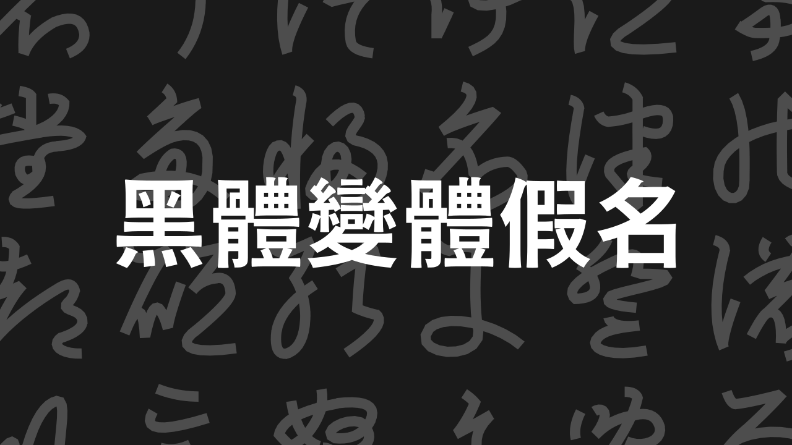

# Hentaigana-Gothic

本項目旨在創造一套開源自由的、黑體風格的變體假名 (Kana Supplement & Kana Extended-A, 包括 Unicode 14.0 草案) 字型。字型檔、源矢量圖的使用、修改、再釋出等一切免費。

此字型將暫時包括「Regular」字重，往後可能繼續添加其他字重。

有興趣參與？想要提出修改意見？我們歡迎您進行問題諮詢、提交拉取請求。

策劃人員：[fitzgerald](zh.moegirl.org.cn/User:FITZGERALD)

參與製作：[fitzgerald](zh.moegirl.org.cn/User:FITZGERALD)，[hulenkius](https://github.com/Hulenkius)，[sinzengo](zht.glyphwiki.org/wiki/User:sinzengo)
